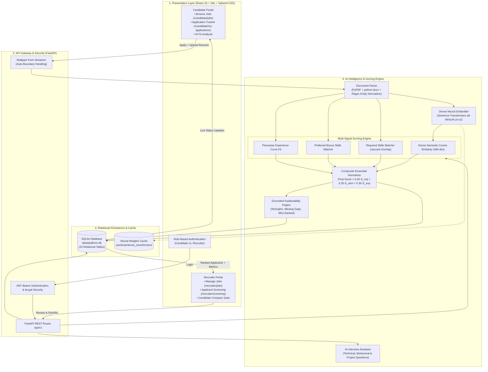
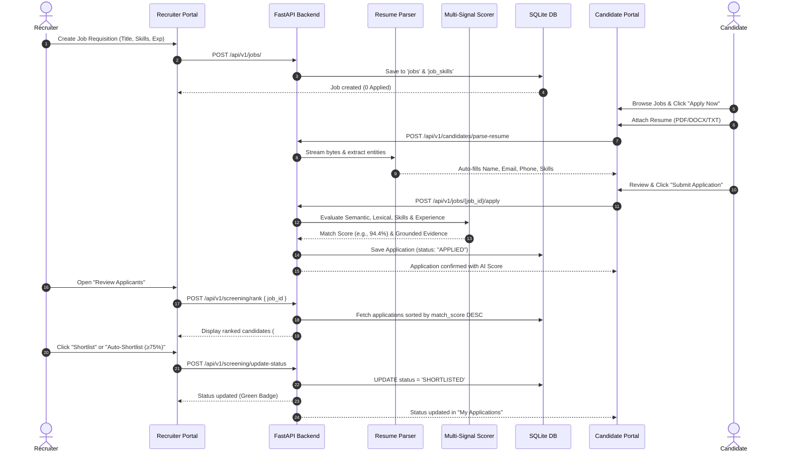
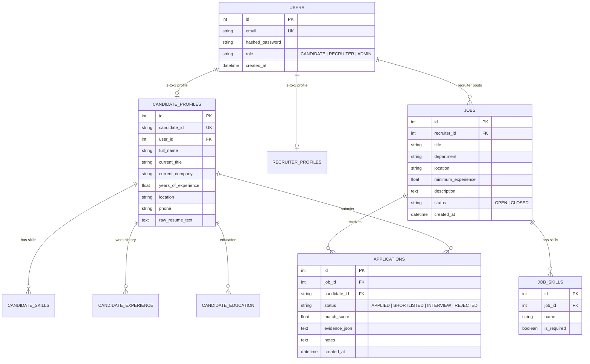

# AI Recruitment Intelligence Platform 🤖⚡

[](https://fastapi.tiangolo.com)
[](https://reactjs.org)
[](https://www.typescriptlang.org)
[](https://www.sbert.net)
[](https://tailwindcss.com)
[](https://www.sqlite.org)
[](https://www.docker.com)
[](LICENSE)

> A production-grade **AI Recruitment Intelligence & Automated Candidate Ranking Platform** featuring real-time job applications, multi-format resume parsing (PDF/DOCX/TXT), hybrid multi-signal AI scoring, grounded explainability (XAI), one-click shortlisting, and Generative AI interview question generation.

---

## 📌 Table of Contents
- [1. Executive Overview](#1-executive-overview)
- [2. System Architecture](#2-system-architecture)
- [3. Core Features](#3-core-features)
- [4. Step-by-Step Workflow](#4-step-by-step-workflow)
- [5. Mathematical Scoring Engine](#5-mathematical-scoring-engine)
- [6. Grounded Explainable AI (XAI)](#6-grounded-explainable-ai-xai)
- [7. Generative AI Interview Assistant](#7-generative-ai-interview-assistant)
- [8. Relational Database Schema](#8-relational-database-schema)
- [9. Security & Role-Based Access Control](#9-security--role-based-access-control)
- [10. RESTful API Reference](#10-restful-api-reference)
- [11. Quickstart & Installation](#11-quickstart--installation)
- [12. Demo Credentials](#12-demo-credentials)
- [13. Viva & Technical Interview Guide](#13-viva--technical-interview-guide)

---

## 1. Executive Overview

Traditional Applicant Tracking Systems (ATS) suffer from two major flaws:
1. **Naive Keyword Matching**: If a resume contains *"Distributed Microservices"* while the job description specifies *"High-Concurrency Cloud Architecture"*, classical keyword filters assign a 0% match, ignoring semantic meaning.
2. **Opaque LLM Wrappers**: Passing raw resumes directly to ChatGPT is slow (2–5 seconds per resume), expensive, non-deterministic, and prone to hallucinations (inventing degrees, years of experience, or missing skills).

### The Solution:
This platform implements a **deterministic, hybrid multi-signal scoring pipeline** that computes semantic vector embeddings, domain-specific skill overlaps, and non-linear experience curves in **sub-15ms latency on standard CPU**. Generative AI is selectively leveraged for high-value tasks like synthesizing custom interview questions and contextual evaluation.

---

## 2. System Architecture



---

## 3. Core Features

### 👔 Recruiter Command Suite
- **Job Lifecycle Management**: Post jobs with structured competencies (`is_required=True/False`), seniority thresholds, location, and department.
- **Live Applicant Metrics**: Every job dynamically displays `{N} Applied` and `{M} Shortlisted` badges.
- **AI-Ranked Applicant Screening**: Real applicants who submitted resumes for the job are ranked in real time by AI fit score (#1, #2, #3...).
- **1-Click Auto-Shortlist**: Automatically shortlists all applicants with match score $\ge 75\%$.
- **Status Workflow Controls**: Single-click transitions between `APPLIED`, `SHORTLISTED`, `INTERVIEW`, and `REJECTED`.
- **In-App Resume Viewer**: View raw resume text, parsed profile details, and verified skills without leaving the screening screen.
- **Instant Demo Data Seeding**: 1-click `+ Add 4 Demo Applicants` button on any job to test scoring across diverse profiles.

### 🎓 Candidate Portal
- **Job Directory**: Browse open openings with requirements, location, and department tags.
- **Instant Multi-Format Application**: Upload resume (`.pdf`, `.docx`, `.txt`) or paste resume text. Auto-extracts name, email, phone, experience, and skills.
- **Zero-Hang Uploads**: Fixed browser `FormData` boundary stripping bug for fast, resilient uploads.
- **Real-Time Application Tracking**: Track submission progress with status badges (*Under Review*, *Shortlisted*, *Interview Scheduled*, *Not Selected*) and live AI Match Scores.
- **Interactive Match Analyzer**: Compare any resume against any job description to discover strengths and missing skills.

---

## 4. Step-by-Step Workflow



---

## 5. Mathematical Scoring Engine

The platform evaluates candidates across four distinct dimensions:

```
                          Candidate Evaluation
                                   │
       ┌──────────────────┬────────┴─────────┬──────────────────┐
       ▼                  ▼                  ▼                  ▼
 Dense Semantic    Required Skills    Preferred Skills    Experience Window
 (Sentence-BERT)   (Jaccard Ratio)    (Bonus Overlap)     (Piecewise Curve)
    w1 = 0.30          w2 = 0.40          w3 = 0.10           w4 = 0.30
```

### 1. Dense Semantic Similarity ($S_{sem}$)
Using `sentence-transformers/all-MiniLM-L6-v2`, candidate resume text and job descriptions are transformed into 384-dimensional dense vectors $\vec{u}$ and $\vec{v}$:

$$\text{Cosine Similarity}(\vec{u}, \vec{v}) = \frac{\vec{u} \cdot \vec{v}}{\|\vec{u}\|_2 \|\vec{v}\|_2}$$

$$S_{sem} = \max\left(0, \min\left(100, \text{Cosine}(\vec{u}, \vec{v}) \times 100\right)\right)$$

*Captures deep contextual meaning even when terminology differs (e.g., "Kafka event streaming" matches "real-time messaging pipeline").*

### 2. Skill Overlap Score ($S_{req}$)
Let $R$ be the set of mandatory skills required for the job, and $C$ be the candidate's verified skills:

$$S_{req} = \left( \frac{|C \cap R|}{|R|} \right) \times 100$$

*Normalized token matching handles punctuation, case, and synonym normalization (e.g., `react.js` $\equiv$ `react`).*

### 3. Non-Linear Experience Curve ($S_{exp}$)
Given candidate experience $E$, required minimum $E_{min}$, and optimal ceiling $E_{max} = E_{min} + 4$:

$$S_{exp} = \begin{cases} 
100.0 & \text{if } E_{min} \le E \le E_{max} \\
\max(20.0, 100.0 - 25.0 \times (E_{min} - E)) & \text{if } E < E_{min} \\
\max(75.0, 100.0 - 3.0 \times (E - E_{max})) & \text{if } E > E_{max}
\end{cases}$$

*Penalizes under-experience steeply while preventing over-qualification penalties for senior candidates.*

### 4. Composite Fit Score ($S_{final}$)
$$S_{final} = 0.40 \times S_{req} + 0.30 \times S_{sem} + 0.30 \times S_{exp}$$

*(Bounded strictly to $[5.0, 99.0]$).*

---

## 6. Grounded Explainable AI (XAI)

Every applicant ranking is supported by verifiable evidence generated deterministically:

```json
{
  "overall_score": 94.4,
  "skill_score": 100.0,
  "semantic_score": 92.5,
  "experience_score": 100.0,
  "matched_skills": ["python", "pytorch", "nlp", "fastapi", "docker", "vector search"],
  "missing_skills": [],
  "recommendation": "Strong Fit",
  "why_ranked": "Matches 4 required skills (python, pytorch, nlp, fastapi). Experience is 5.0 yrs for a 4.0+ yr role.",
  "strengths": [
    "Hands-on expertise in python",
    "Hands-on expertise in pytorch",
    "Hands-on expertise in nlp"
  ],
  "skill_gaps": []
}
```

* **No Hallucinations**: Reasons are generated directly from set intersections and mathematical features rather than free-form LLM guesswork.

---

## 7. Generative AI Interview Assistant

Clicking **"AI Questions"** on any candidate card dynamically generates three tailored interview categories:

| Category | Purpose | Example Question |
| :--- | :--- | :--- |
| **Technical & Architecture** | Deep-dives into matched technologies | *"Given your background in PyTorch and vector retrieval, how would you optimize embedding generation latency under high concurrency?"* |
| **Behavioral & Leadership** | Calibrated to candidate's seniority | *"Describe a critical production outage in your FastAPI microservices and your step-by-step resolution strategy."* |
| **Resume Project Probing** | Validates authenticity of listed projects | *"Walk us through the architecture and specific contributions of your most recent machine learning system listed on your resume."* |

*Features a 1-click **"Copy Questions"** button for interview panels.*

---

## 8. Relational Database Schema

The database (`data/platform.db`) consists of **10 normalized relational tables**:



---

## 9. Security & Role-Based Access Control

- **Cryptographic Password Hashing**: Passwords are saved as one-way salted hashes via **`bcrypt`** (`passlib[bcrypt]`).
- **Stateless JWT Tokens**: HMAC-SHA256 tokens contain user ID, role, and expiration timestamps.
- **Route Guarding**:
  - `require_candidate`: Enforces access on `/candidates/my-applications` and application routes.
  - `require_recruiter`: Enforces access on `/jobs/`, `/screening/rank`, `/screening/update-status`.
- **Portal Isolation**: Candidate and Recruiter interfaces are cleanly decoupled with client-side route guards.

---

## 10. RESTful API Reference

| Endpoint | Method | Role | Description |
| :--- | :---: | :---: | :--- |
| `/api/v1/auth/register` | `POST` | Public | Register new Candidate or Recruiter |
| `/api/v1/auth/login` | `POST` | Public | Authenticate user & issue JWT Bearer Token |
| `/api/v1/jobs/` | `GET` | All | Fetch all open job openings with applicant counts |
| `/api/v1/jobs/` | `POST` | Recruiter | Create a new job requisition |
| `/api/v1/jobs/{id}/apply` | `POST` | Candidate | Submit application with resume & details |
| `/api/v1/jobs/{id}/seed-demo-applicants` | `POST` | Recruiter | Inject 4 demo candidates for testing |
| `/api/v1/candidates/parse-resume` | `POST` | Public | Fast extract & parse PDF/DOCX/TXT resume |
| `/api/v1/candidates/my-applications` | `GET` | Candidate | Fetch candidate's applied roles & live statuses |
| `/api/v1/screening/rank` | `POST` | Recruiter | Rank applicants for a job via AI scoring |
| `/api/v1/screening/update-status` | `POST` | Recruiter | Update status (`SHORTLISTED`, `INTERVIEW`, `REJECTED`) |
| `/api/v1/screening/auto-shortlist` | `POST` | Recruiter | Auto-shortlist applicants with match score $\ge 75\%$ |
| `/api/v1/screening/interview-questions` | `POST` | Recruiter | Synthesize custom AI interview questions |
| `/api/v1/health` | `GET` | Public | Service health & model status check |

---

## 11. Quickstart & Installation

### Prerequisites
- **Python**: 3.10+ (Tested on Python 3.11 & 3.13)
- **Node.js**: 18+ & **npm**: 9+

### 1. Clone & Set Up Backend

```bash
# Clone the repository
git clone https://github.com/NikitaMehra884/AI-Resume-Ranking-System.git
cd "AI-Resume-Ranking-System"

# Create and activate Python virtual environment
python -m venv venv
# Windows:
.\venv\Scripts\activate
# Linux/macOS:
source venv/bin/activate

# Install dependencies
pip install -r requirements.txt

# Seed database with initial accounts and jobs
python scripts/seed_db.py

# Start FastAPI backend server
uvicorn backend.app.main:app --host 127.0.0.1 --port 8000 --reload
```
*API Swagger Documentation: [http://127.0.0.1:8000/docs](http://127.0.0.1:8000/docs)*

### 2. Set Up Frontend

```bash
# Open a new terminal and navigate to frontend
cd frontend

# Install Node dependencies
npm install

# Start Vite frontend dev server
npm run dev
```
*Frontend Interface: [http://localhost:3000](http://localhost:3000)*

### 3. Docker Deployment (Optional)

Run the full platform with Docker Compose:
```bash
docker-compose up --build
```

---

## 12. Demo Credentials

The database comes pre-seeded with sample test accounts:

| Role | Email | Password | Primary Capabilities |
| :--- | :--- | :--- | :--- |
| **Recruiter** | `recruiter@platform.ai` | `password123` | Post jobs, review AI-ranked applicants, auto-shortlist, generate AI interview questions |
| **Candidate** | `candidate@platform.ai` | `password123` | Browse jobs, upload resumes, track application status, view match analysis |

---

## 13. Viva & Technical Interview Guide

### Q1: Why not simply pass the entire resume and JD to ChatGPT?
> **Answer**: Direct LLM screening is slow (2–5 seconds per resume), costly ($0.02–$0.05 per API call), and non-deterministic (prone to hallucinating qualifications). Our hybrid engine computes deterministic multi-signal embeddings and exact skill overlaps in **< 15ms per candidate** on standard CPU, using Generative AI only for interview question synthesis.

### Q2: How does dense semantic similarity differ from keyword search?
> **Answer**: Keyword matching fails on variations (e.g., "Kubernetes" vs "K8s", or "NLP" vs "Computational Linguistics"). Dense embeddings map words to a continuous 384-dimensional vector space where conceptual synonyms naturally have high cosine similarity.

### Q3: How is algorithmic bias prevented?
> **Answer**: Demographic attributes (gender, age, race, photos, addresses) are excluded from vector embedding and scoring pipelines. Only verified technical competencies, career tenure, and domain relevance are computed.

### Q4: How is data synchronized between Recruiter and Candidate?
> **Answer**: Applications are tracked via foreign-key relationships in the relational `applications` table. When a recruiter clicks "Shortlist" or "Interview", an atomic database update writes the status and triggers instant state reflection in both recruiter tables and candidate tracking dashboards.

---

## 📄 License
This project is open-source under the [MIT License](LICENSE).