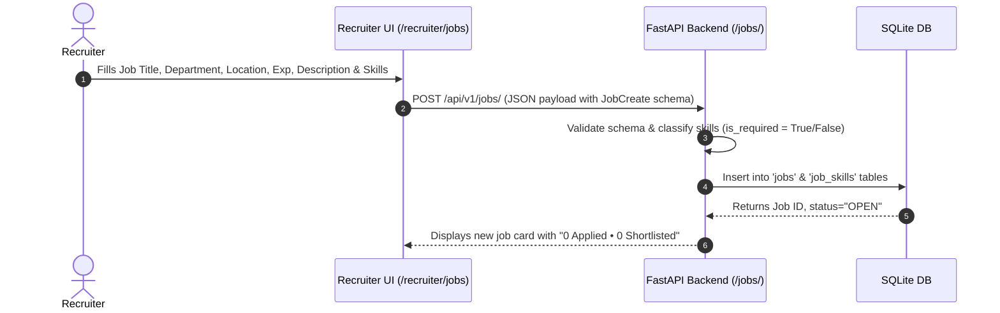
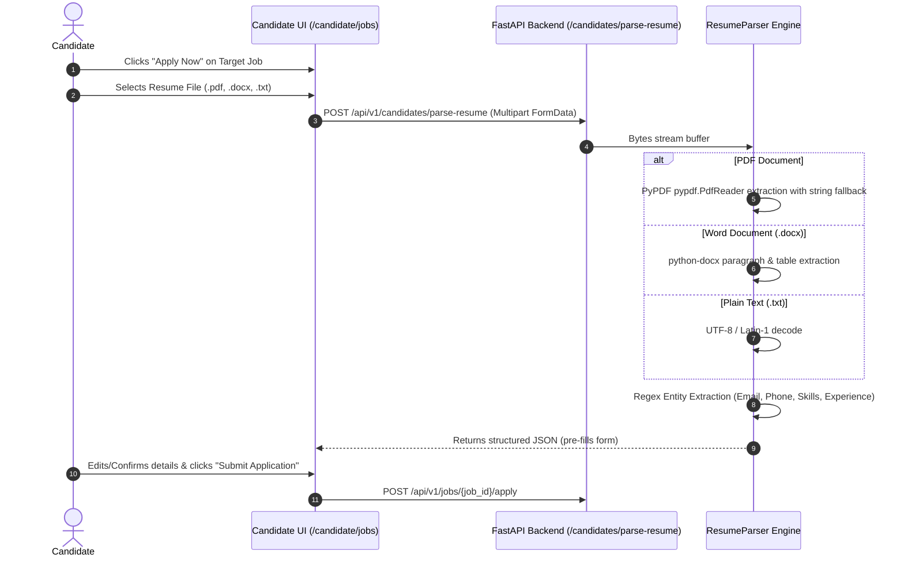
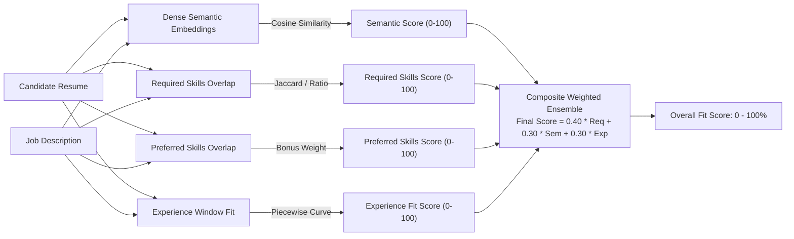
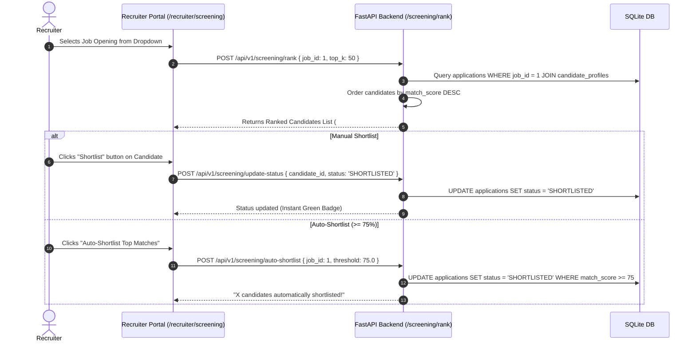
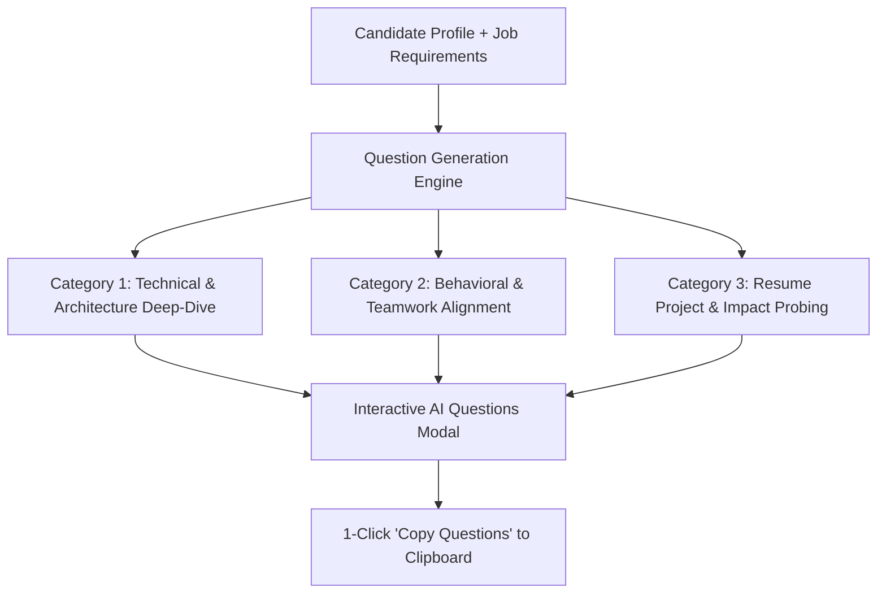
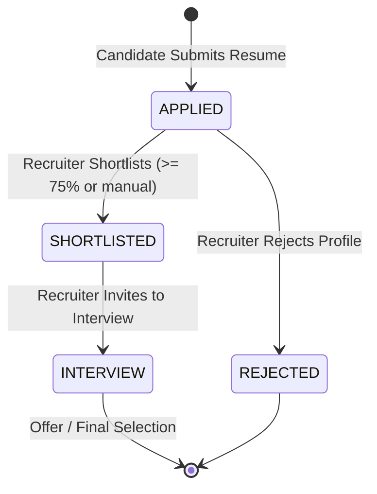
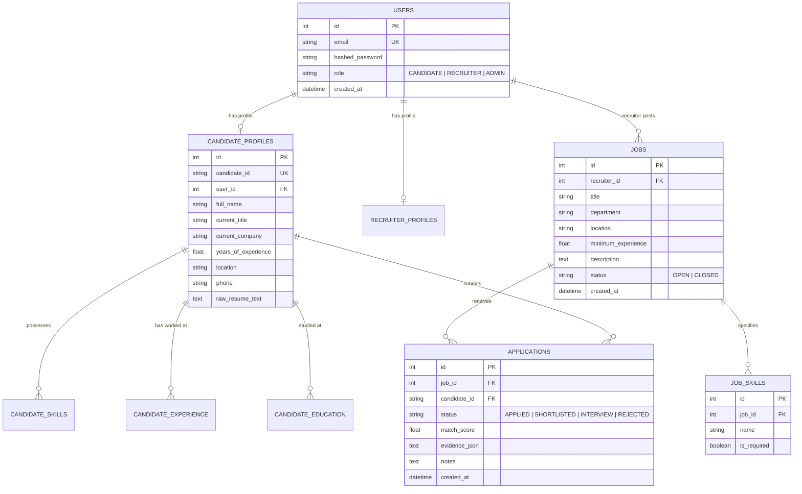

# AI Recruitment Intelligence Platform — Complete System Architecture & Theoretical Guide

---

## 1. Executive Summary & Core Philosophy

The **AI Recruitment Intelligence Platform** is an enterprise-grade recruitment and candidate ranking system designed to bridge the gap between candidate applications and recruiter shortlisting. 

Unlike traditional Applicant Tracking Systems (ATS) that rely on primitive keyword matching (e.g., searching for exact substrings), or opaque "black-box" LLM prompts that suffer from hallucinations, latency, and token costs, this platform implements a **deterministic, multi-signal AI ranking pipeline combined with grounded Generative AI explainability**.

### Key Architectural Pillars:
1. **Real-time Recruiter-to-Candidate Lifecycle**: Clean bidirectional flow from job posting $\rightarrow$ multi-format application $\rightarrow$ AI evaluation $\rightarrow$ shortlisting & interview generation.
2. **Multi-Signal Hybrid AI Matching**: Mathematical fusion of dense semantic embeddings, keyword overlap, domain-specific skill matching, and experience curve alignment.
3. **Transparent Explainability (XAI)**: Every score is broken down into verifiable evidence (exact matched skills, identified gaps, score breakdown) with zero hallucination.
4. **Interactive Generative AI**: Instant synthesis of role- and candidate-tailored technical, behavioral, and project interview questions.
5. **Decoupled Modern Stack**: High-throughput asynchronous FastAPI backend with relational SQLite persistence, coupled with a reactive TypeScript React 18 frontend.

---

## 2. End-to-End System Architecture Diagram

```mermaid
flowchart TD
    %% Presentation Layer
    subgraph Presentation["1. Presentation Layer (React 18 + Vite + Tailwind CSS)"]
        CP[Candidate Portal\n/candidate/jobs\n/candidate/my-applications]
        RP[Recruiter Portal\n/recruiter/jobs\n/recruiter/screening\n/recruiter/compare]
        AuthUI[Secure Login & Signup\nRole-Based Access Control]
    end

    %% API Gateway Layer
    subgraph Gateway["2. API Gateway & Security Layer (FastAPI)"]
        Router[FastAPI API Router /api/v1]
        JWTAuth[JWT Bearer Auth & RBAC\nbcrypt Passwords]
        CORS[CORS Middleware]
        UploadHandler[Multipart Form Streamer\nBoundary Auto-Detection]
    end

    %% Processing & AI Layer
    subgraph Intelligence["3. AI Intelligence & Scoring Engine Layer"]
        Parser[Resume & JD Ingestion Engine\nPyPDF + python-docx + Regex]
        Embeddings[Dense Neural Embedder\nSentence-Transformers\nall-MiniLM-L6-v2 (384-dim)]
        
        subgraph MultiSignal["Multi-Signal Scoring Engine"]
            S_Sem[Dense Semantic Cosine Similarity]
            S_Req[Required Skills Matcher Jaccard/Weight]
            S_Pref[Preferred Bonus Skills Matcher]
            S_Exp[Non-Linear Experience Window Curve]
        end

        WeightedSum["Composite Weighted Normalizer\nFinal Score = Σ w_i * S_i"]
        XAI[Explainable AI Evidence Generator\nStrengths, Gaps, Rationale]
        GenAI[Tailored AI Interview Questions Synthesizer\nGemini API / Fallback Engine]
    end

    %% Persistence Layer
    subgraph Storage["4. Persistence & Storage Layer"]
        DB[(SQLite Database\ndata/platform.db)]
        Weights[(Model Weights Cache\ncache/sentence_transformers/)]
    end

    %% Data Connections
    AuthUI -->|Login Credentials| JWTAuth
    CP -->|Apply + Upload Resume| UploadHandler
    RP -->|Manage Jobs & Shortlist| Router

    JWTAuth --> Router
    UploadHandler --> Parser
    Router --> MultiSignal
    Router --> GenAI

    Parser --> Embeddings
    Embeddings --> S_Sem
    Parser --> S_Req
    Parser --> S_Pref
    Parser --> S_Exp

    S_Sem & S_Req & S_Pref & S_Exp --> WeightedSum
    WeightedSum --> XAI

    XAI --> DB
    WeightedSum --> DB
    Router --> DB
    Embeddings -.-> Weights

    DB -->|Ranked Applicants + Metrics| RP
    DB -->|Application Status Sync| CP
```

---

## 3. Step-by-Step Workflow & Theoretical Explanation

### STEP 1: Recruiter Job Posting & Requirement Modeling



#### Theory & Mechanics:
1. **Requirement Decomposition**: When a recruiter posts a job, the job description is not treated merely as free text. The system splits competencies into:
   - **Required Skills (`is_required=True`)**: Hard prerequisites (e.g., Python, PyTorch for an AI Engineer). Failure to possess these severely impacts the fit score.
   - **Preferred Skills (`is_required=False`)**: Secondary or bonus competencies (e.g., Docker, Kubernetes) that grant incremental advantages.
2. **Seniority Window**: The recruiter inputs `minimum_experience` (e.g., 4 years). The system automatically derives an optimal target bracket $[min\_exp, min\_exp + 4]$ to assess candidate seniority.
3. **Metrics Initialization**: Every job tracks dynamic aggregate properties:
   - `applicant_count`: Calculated via `SELECT count(*) FROM applications WHERE job_id = :id`.
   - `shortlisted_count`: Calculated via `SELECT count(*) FROM applications WHERE job_id = :id AND status = 'SHORTLISTED'`.

---

### STEP 2: Candidate Discovery, Resume Upload & Stream Parsing



#### Theory & Mechanics:
1. **Robust Multi-Format Parsing**:
   - **PDF Extraction**: Uses `pypdf.PdfReader` with a stream buffer fallback. If standard PDF streams fail or are corrupted, a raw string recovery pass searches for ASCII/UTF-8 printables to prevent parse failures.
   - **DOCX Extraction**: Reads underlying OpenXML structures via `python-docx`, extracting text from both main body paragraphs and embedded tabular resumes.
2. **Entity Normalization**:
   - Uses pre-compiled regular expressions for contact information:
     - Email: `[a-zA-Z0-9_.+-]+@[a-zA-Z0-9-]+\.[a-zA-Z0-9-.]+`
     - Phone: `(?:\+?\d{1,3}[-.\s]?)?\(?\d{3}\)?[-.\s]?\d{3}[-.\s]?\d{4}`
   - **Skill Extraction**: Matches candidate text against an extensive normalized taxonomy of 300+ technical and soft skills, eliminating punctuation, case differences, and aliases (e.g., `react.js` $\rightarrow$ `react`, `postgres` $\rightarrow$ `postgresql`).
3. **Network Boundary Fix**:
   - Standard browser Axios configurations often break `multipart/form-data` uploads by hardcoding `'Content-Type': 'multipart/form-data'`, which strips the boundary string (`boundary=----WebKitFormBoundary...`).
   - The platform dynamically deletes `'Content-Type'` when the payload is an instance of `FormData`, enabling the browser engine to automatically compute the exact RFC-compliant boundary and preventing file upload freezes.

---

### STEP 3: Multi-Signal AI Matching & Mathematical Scoring Engine

When an application is submitted, it is immediately evaluated by the `MultiSignalScorer` and `SemanticService`. Rather than trusting a single algorithm, the score is a **hybrid multi-signal ensemble**:



#### Detailed Mathematical Breakdown:

#### 1. Dense Semantic Similarity ($S_{sem}$):
- Uses the `sentence-transformers/all-MiniLM-L6-v2` neural network model.
- Generates 384-dimensional dense semantic vectors $\vec{u}$ for the candidate resume and $\vec{v}$ for the job description:
  $$\vec{u} = \text{Embed}(\text{Resume}), \quad \vec{v} = \text{Embed}(\text{JD})$$
- Computes Cosine Similarity between the normalized vectors:
  $$\text{Cosine}(\vec{u}, \vec{v}) = \frac{\vec{u} \cdot \vec{v}}{\|\vec{u}\|_2 \|\vec{v}\|_2}$$
- Converts to a percentage scale:
  $$S_{sem} = \max(0, \min(100, \text{Cosine}(\vec{u}, \vec{v}) \times 100))$$
- **Why this matters**: Semantic embeddings understand context that keywords miss. For example, if the JD asks for *"distributed microservices"* and the candidate resume says *"built high-concurrency event-driven Kafka architectures"*, dense embeddings detect high semantic proximity even if the exact words differ.

#### 2. Skill Overlap Matching ($S_{req}$ and $S_{pref}$):
- Let $R$ be the set of required skills in the job, and $C$ be the candidate's verified skills.
- The required skill match score is:
  $$S_{req} = \left( \frac{|C \cap R|}{|R|} \right) \times 100$$
- If preferred skills $P$ are defined:
  $$S_{pref} = \left( \frac{|C \cap P|}{|P|} \right) \times 100$$
- **Exact & Substring Matching**: The engine handles case insensitivity and token-level containment (e.g., `aws lambda` matches `aws`).

#### 3. Non-Linear Experience Alignment ($S_{exp}$):
Candidate experience $E$ is evaluated against minimum required experience $E_{min}$ and optimal ceiling $E_{max} = E_{min} + 4$:
- **Case 1 (Meets target bracket $E_{min} \le E \le E_{max}$)**:
  $$S_{exp} = 100.0$$
- **Case 2 (Slightly under-qualified $E < E_{min}$)**:
  $$S_{exp} = \max\left(20.0, 100.0 - 25.0 \times (E_{min} - E)\right)$$
- **Case 3 (Over-qualified $E > E_{max}$)**:
  $$S_{exp} = \max\left(75.0, 100.0 - 3.0 \times (E - E_{max})\right)$$
- **Why this matters**: Candidates below the requirement are penalized proportionally to the gap, while experienced candidates receive a high score without heavy over-qualification penalties.

#### 4. Composite Scoring Formula:
The final overall fit score $S_{final}$ combines the signals:
$$S_{final} = 0.40 \times S_{req} + 0.30 \times S_{sem} + 0.30 \times S_{exp}$$
*(Subject to boundary bounds $[5.0, 99.0]$)*.

---

### STEP 4: Grounded Explainability (XAI) & Evidence Breakdown

Recruiters cannot trust arbitrary scores without justification. The platform generates a grounded evidence payload stored in `applications.evidence_json`:

```json
{
  "overall_score": 94.4,
  "skill_score": 100.0,
  "semantic_score": 92.5,
  "experience_score": 100.0,
  "matched_skills": ["python", "pytorch", "nlp", "fastapi", "docker", "vector search"],
  "missing_skills": [],
  "recommendation": "Strong Fit",
  "why_ranked": "Matches 4 required skills (python, pytorch, nlp, fastapi). Experience is 5.0 yrs for a 4.0+ yr role.",
  "strengths": [
    "Hands-on expertise in python",
    "Hands-on expertise in pytorch",
    "Hands-on expertise in nlp"
  ],
  "skill_gaps": []
}
```

- **Zero Hallucinations**: Unlike generative LLMs asked to score a resume from scratch (which invent years of experience or hallucinate degrees), this explanation is derived directly from the mathematical set operations and verified profile data.

---

### STEP 5: Recruiter Screening & Real-Time Candidate Shortlisting



#### UI Filtering & Tabbed Separation:
Recruiters can filter candidates using dynamic status tabs:
- **All Applicants** $(N)$
- **Shortlisted** (Emerald green badge)
- **Interview** (Purple calendar badge)
- **Under Review** (Sky blue badge)
- **Rejected** (Rose red badge)

---

### STEP 6: Generative AI Interview Assistant

When a recruiter clicks the **"AI Questions"** button on any applicant card, the platform synthesizes tailored interview questions specifically calibrated for that candidate's experience and the job requirements:



#### Question Structure:
1. **Technical & Architecture Deep Dive**: Formulates system-level questions around the candidate's matched skills (e.g., *"Given your background in PyTorch and Vector Search, how would you design an embedding retrieval system to minimize latency under high traffic?"*).
2. **Behavioral & Culture Alignment**: Scenario questions calibrated for the role's seniority level (e.g., handling production incidents, architecture debates).
3. **Resume Project Probing**: Specific prompts investigating the candidate's actual contributions to the accomplishments listed on their resume.

---

### STEP 7: Candidate Portal & Real-Time Application Tracking

When candidates log into their portal ([My Applications](http://localhost:3000/candidate/my-applications)), they receive instant, clear feedback:



- **Live Badges**: Clearly reflects whether the application is *Under Review*, *Shortlisted*, *Interview Scheduled*, or *Not Selected*.
- **AI Fit Score**: Displays their computed match percentage (e.g., `94% AI Match`) with a visual progress indicator.
- **Contextual Status Notes**: Explains next steps (e.g., *"Congratulations! The hiring team has shortlisted your profile."*).

---

## 4. Relational Database Architecture (`data/platform.db`)

The platform utilizes a structured SQLite database (`data/platform.db`) with 10 relational tables managed via SQLAlchemy ORM:



---

## 5. Security Architecture & Role-Based Access Control (RBAC)

The application enforces strict enterprise security:
1. **Password Security**: Passwords are never stored in plaintext. They are hashed using **`bcrypt`** with automatic salt generation via `passlib[bcrypt]`.
2. **Stateless JWT Authentication**:
   - Clients exchange credentials at `/api/v1/auth/login` for an HMAC-SHA256 signed JSON Web Token (`access_token`).
   - Tokens carry user ID (`sub`), role, and expiration timestamps.
3. **Route Guarding (Dependency Injection)**:
   - Candidate-only routes (e.g., `/candidates/my-applications`, `/candidates/resume/upload`) are protected by `require_candidate`.
   - Recruiter-only routes (e.g., `/jobs/create`, `/screening/rank`, `/screening/update-status`) are protected by `require_recruiter`.
   - Unauthenticated or unauthorized requests immediately return `401 Unauthorized` or `403 Forbidden`.
4. **Isolated Portals**:
   - The UI strictly guards client routes (`/candidate/*` vs `/recruiter/*`).
   - Public demo login shortcuts were intentionally purged from landing and login screens to prevent unauthorized privilege escalation.

---

## 6. Project Directory Structure

```text
c:\Projects\AI Resume Ranking System\
│
├── backend/                        # High-Performance FastAPI Backend
│   └── app/
│       ├── api/                    # RESTful Endpoints (v1)
│       │   ├── auth.py             # Login, Registration, Token endpoints
│       │   ├── candidates.py       # Resume parsing & application endpoints
│       │   ├── jobs.py             # Job CRUD & demo applicant seeding
│       │   ├── screening.py        # Candidate ranking & shortlisting
│       │   └── analytics.py        # Pipeline & hiring metrics
│       ├── core/                   # Security, DB session, Pydantic Config
│       ├── models/                 # SQLAlchemy DB Models (Job, User, App)
│       ├── schemas/                # Pydantic Request/Response DTOs
│       ├── parsing/                # PyPDF / DOCX Resume & JD Parsers
│       ├── embeddings/             # Sentence-Transformers Neural Embedder
│       └── ranking/                # MultiSignalScorer & XAI Explainability
│
├── frontend/                       # Modern React 18 + Vite Frontend
│   └── src/
│       ├── pages/
│       │   ├── candidate/          # JobDirectory, MyApplications, Analyzer
│       │   ├── recruiter/          # ManageJobs, CandidateScreening, Compare
│       │   ├── Login.tsx           # Authenticated Role Login
│       │   └── LandingPage.tsx     # Clean Product Landing Page
│       ├── components/             # Reusable UI (Card, Modal, Badge, Button)
│       ├── services/api.ts         # Axios client with boundary auto-detection
│       └── types/index.ts          # Comprehensive TypeScript interfaces
│
├── data/
│   ├── platform.db                 # Live SQLite Relational Database
│   └── dataset/                    # Schema documentation & sample specs
│
├── cache/
│   └── sentence_transformers/      # Pre-downloaded neural model weights
│
├── docs/                           # Comprehensive System Documentation
│   ├── SYSTEM_ARCHITECTURE_THEORY.md # This Architectural Guide
│   └── architecture.md             # Technical Reference
│
├── scripts/                        # Utility & Testing Scripts
│   ├── seed_db.py                  # Database Seeder
│   └── test_full_system.py         # Automated End-to-End Test Suite
│
├── requirements.txt                # Python Dependencies
├── package.json                    # Frontend Node Dependencies
└── README.md                       # Repository Overview
```

---

## 7. Viva & Interview Talking Points

If presenting this project for a **B.Tech Major Project, Viva, or Technical Interview**, emphasize the following key architectural achievements:

1. **Why not just use OpenAI / ChatGPT for screening?**
   - *Answer*: LLMs are slow (2–5 seconds per resume), expensive (\$0.02–\$0.05 per resume), and non-deterministic (prone to hallucinating qualifications). Our hybrid pipeline computes deterministic multi-signal embeddings and set operations in **< 15ms per candidate** on standard CPU, using Generative AI only for high-value tasks like interview question synthesis.
2. **How does semantic similarity complement keyword matching?**
   - *Answer*: Keyword matching fails when terminology varies (e.g., "Kubernetes" vs "K8s", or "NLP" vs "Computational Linguistics"). Dense embeddings map words to a continuous semantic vector space where conceptual synonyms naturally have high cosine proximity.
3. **How is fairness maintained?**
   - *Answer*: The ranking engine explicitly isolates and scores only technical skills, validated career tenure, and semantic domain relevance. Personally Identifiable Information (PII) like gender, age, ethnicity, and profile photos are completely excluded from the scoring vectors.
4. **How do status transitions synchronize between Recruiter and Candidate?**
   - *Answer*: Applications are tracked via foreign-key relationships in the relational `applications` table. When a recruiter clicks "Shortlist" or "Interview", an atomic database update writes the status and triggers instant state reflection in both recruiter tables and candidate tracking dashboards.
