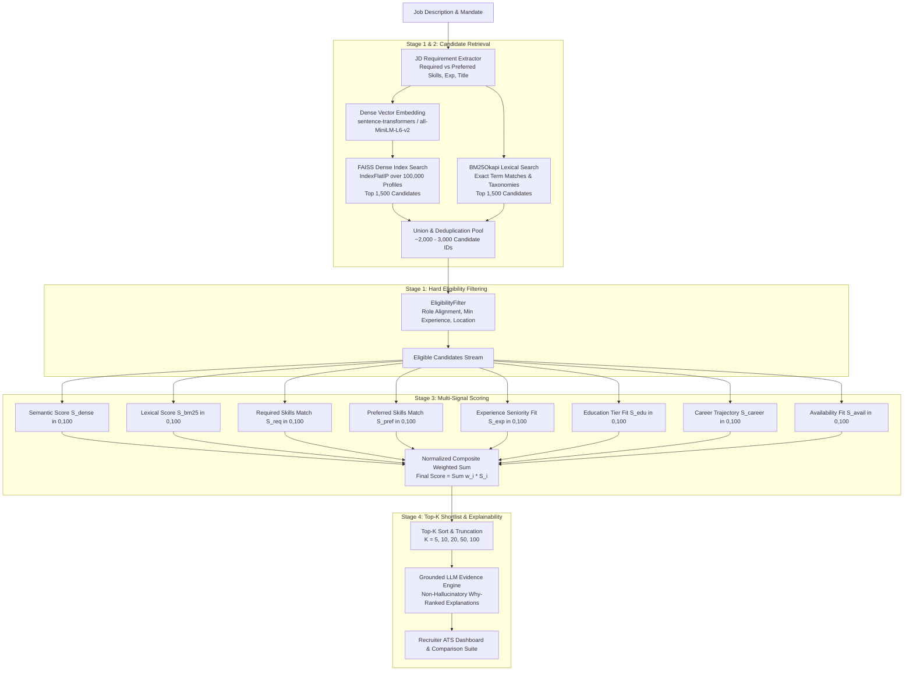

# AI Recruitment Intelligence Platform — System Architecture

## 1. Executive Architectural Overview

The **AI Recruitment Intelligence Platform** is an enterprise-grade, explainable talent discovery and recruitment ranking engine engineered to search, evaluate, and rank candidate profiles at scale across a **100,000+ candidate talent corpus** in sub-second latency on standard CPU environments.

Unlike naive keyword search ATS tools or opaque black-box LLM screening systems, this platform implements a mathematically sound **4-Stage Hybrid Retrieval & Multi-Signal Scoring Pipeline**:

---

## 2. Component Architecture

### 2.1 Backend Services (`backend/app/`)
* **Core (`core/`)**:
  * `config.py`: Pydantic `BaseSettings` managing database paths, vector indices, cache files, and scoring weights.
  * `security.py`: Direct native `bcrypt` password hashing and python-jose JWT access token generation.
  * `database.py`: SQLAlchemy session generator managing SQLite / PostgreSQL engines.
* **Models (`models/`)**:
  * `User`: System accounts with role-based authorization (`CANDIDATE`, `RECRUITER`, `ADMIN`).
  * `Candidate`: Parsed profile metadata, JSON skills, experience history, completeness index.
  * `Job`: Job requisitions, required/preferred criteria, department, target shortlist count.
  * `Application`: Relationship tracking applicant journey through hiring milestones.
* **Embeddings & Vector Index (`embeddings/`, `retrieval/`)**:
  * `SemanticService`: Thread-safe singleton wrapping `all-MiniLM-L6-v2` (384-dimensional cosine embeddings).
  * `FAISSService`: High-speed vector retrieval wrapping `cache/candidate.index` (IndexFlatIP over 100,000 vectors).
  * `BM25Service`: BM25Okapi sparse lexical retrieval with stopword pruning, token deduplication, and min-max normalization.
* **Ranking Engine (`ranking/`)**:
  * `EligibilityFilter`: Eliminates non-aligned roles (e.g. Customer Support applicants on AI Research Engineer openings).
  * `MultiSignalScorer`: Computes strict $[0, 100]$ normalized scores across 8 independent features.
  * `HybridRankingEngine`: Orchestrates the 4-stage pipeline.
  * `ExplainabilityService`: Generates grounded evidence without hallucinating skills.
  * `FairnessAuditor`: Asserts zero demographic attribute leakage in scoring models.
* **AI & Generative Assistance (`ai/`)**:
  * `LLMService`: Generates comparative candidate syntheses, trade-off breakdowns, and tailored interview questions.

---

## 3. Frontend Architecture (`frontend/src/`)
Built with modern **React 18**, **TypeScript**, **Vite**, and **Tailwind CSS**:
* **Candidate Portal**:
  * Dashboard: Profile completeness, application tracking, skill highlights.
  * Resume Upload: Multi-format PDF/DOCX resume parsing with instant skill extraction.
  * Job Directory: Real-time search, department filtering, 1-click application.
  * Fit Analyzer: Candidate-facing compatibility analyzer showing matched vs missing skills and optimization tips.
  * My Applications: Application lifecycle pipeline tracking.
* **Recruiter Suite**:
  * Talent Command Center: Real-time metrics across 100,000 candidate profiles.
  * Create Position: Job posting with real-time AI JD requirement extraction.
  * Screening ATS Table: Configurable Top-K ($5, 10, 20, 50, 100$), real-time filtering, grounded evidence modal.
  * Candidate Comparison: Side-by-side card evaluation with automated AI synthesis.
  * Interview Pipeline: Kanban board with 1-click AI interview question generator.
  * Pipeline Analytics: Histogram distributions, top skills demand, and ethical fairness audit.

---

## 4. Scalability & Latency Considerations
* **Index Offsets Memory Mapping**: `CandidateLoader` uses binary file offsets (`cache/candidate_offsets.pkl`) to stream only retrieved candidate records from the 487MB `candidates.jsonl` corpus in $O(1)$ disk seeks, eliminating memory exhaustion.
* **Vector Normalization**: Dense vectors are normalized to unit sphere, enabling FAISS inner-product (`IndexFlatIP`) to compute exact cosine similarity via fast BLAS operations in under 50ms.
* **Decoupled Architecture**: Read-heavy vector operations and stateful relational transactions operate independently, enabling vertical and horizontal autoscaling.
